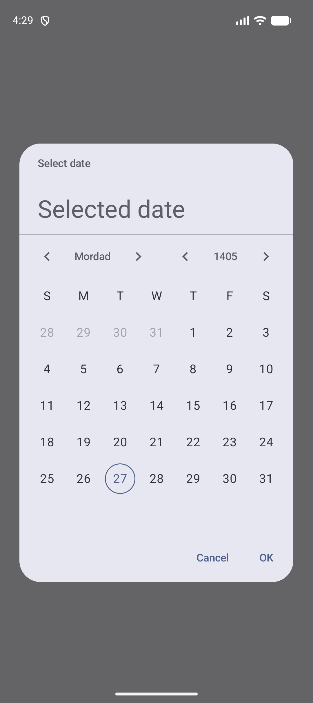
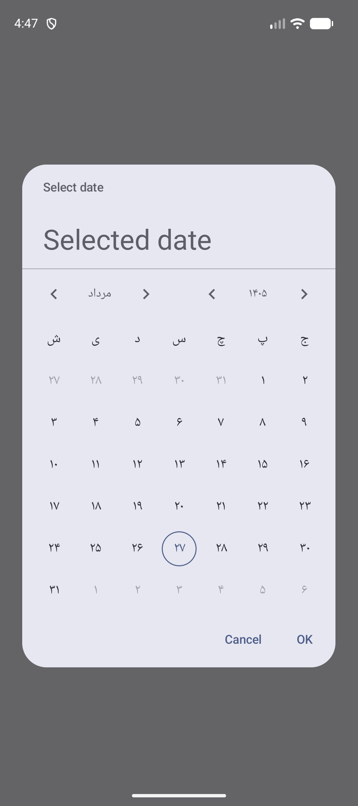
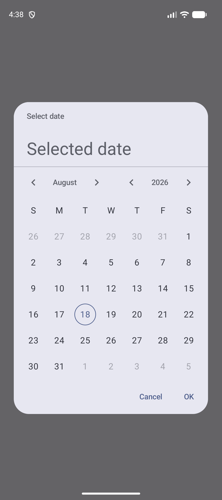
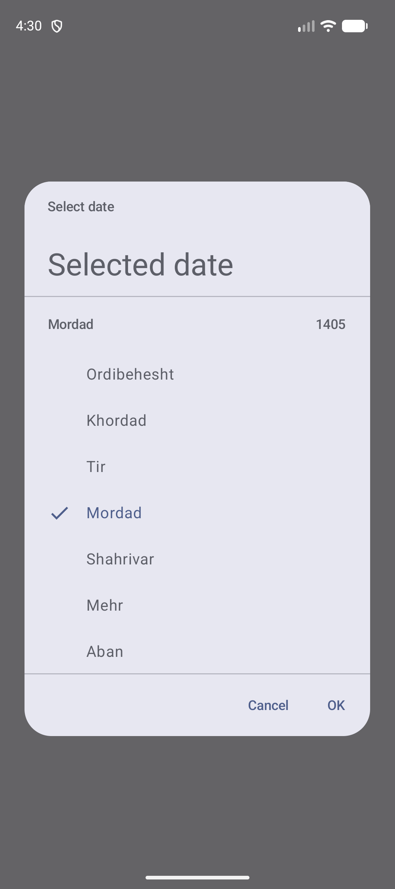

# PersianDatePicker

[](https://jitpack.io/#AliBinkhani/PersianDatePicker)
[](LICENSE)
[](https://developer.android.com/studio/releases/platforms)
[](https://m3.material.io/components/date-pickers/overview)

A Jetpack Compose **Material 3** date picker for Android with first-class support for the
**Persian (Jalali / Solar Hijri) calendar**, alongside the standard **Gregorian** calendar — in
the same component, switchable at will.

This library started as a copy of `androidx.compose.material3`'s `DatePicker` (adapted because
several types it depends on — `CalendarModel`, design tokens, `Strings`, `Icons` — are `internal`
to the material3 module and can't be reused or subclassed from outside of it), then extended with
Persian calendar support and a few pieces the original component doesn't have, such as a month
picker. Its look, spacing, and behavior follow the
[Material 3 date-picker spec](https://m3.material.io/components/date-pickers/specs).

## Screenshots

<table>
  <tr>
    <td align="center"><br><sub>Persian calendar (English UI)</sub></td>
    <td align="center"><br><sub>Persian calendar (Farsi UI)</sub></td>
    <td align="center"><br><sub>Gregorian calendar</sub></td>
    <td align="center"><br><sub>Month picker</sub></td>
  </tr>
</table>

## Features

- **Built on Jetpack Compose + Material 3.** Colors are read from `MaterialTheme.colorScheme` and
  fully customizable via `DatePickerColors`, so the picker automatically fits your app's theme
  (including dynamic color and dark mode) instead of looking like a foreign component.
- **Persian and Gregorian calendars, side by side.** Every `DatePicker` picks a `CalendarType`
  (`PERSIAN` or `GREGORIAN`); switching it changes how dates are computed and displayed — leap
  years, month lengths, and all — without changing anything else about how you use the API.
- **Persian and English UI, for both calendars.** The picker's date formatting (month names,
  digits, weekday names, RTL layout) follows an explicit `locale` you pass in, independent of the
  calendar system. That means you can show a Persian calendar in English (`مرداد` → "Mordad") or a
  Gregorian calendar in Farsi, not just the two "expected" combinations.
- **A month picker**, in addition to the year picker — tap the month field to jump straight to any
  month in the current year, the same way the year field opens a year list. This isn't in the
  upstream `androidx.compose.material3` `DatePicker`, which only offers a year picker.
- **Independent month/year navigation arrows**, each optionally hidden via
  `showMonthNavigationArrows`/`showYearNavigationArrows` — the upstream component only offers
  month arrows.
- **Adjacent month days.** The leading/trailing grid cells can show the (disabled, grayed-out) day
  numbers from the previous/next month per the Material 3 spec, toggleable with
  `showAdjacentMonthDays`.
- **A calendar-aware `CalendarDate` type**, used instead of a raw millisecond `Long`, for reading
  and writing the selected date. It carries its own `CalendarType`, so handing a Gregorian date to
  a Persian picker (or vice versa) auto-converts instead of producing a nonsense date.
- **Interop helpers** for `java.util.Date`, `java.time.LocalDate`, and UTC-millisecond `Long`, so
  integrating with existing timestamp-based code (a database, a REST API, `LocalDate.now()`)
  doesn't require doing calendar math by hand.
- **A `DatePickerDialog`** that fixes a real layout bug in the upstream Material 3 dialog (the
  weekday-letter row overlapping the first row of day numbers) by using a naturally
  wrap-content-height `Surface` instead of upstream's dynamic-height machinery, which exists there
  to support an Input display mode this library doesn't implement.

## Requirements

| | |
|---|---|
| **minSdk** | 26 (Android 8.0) |
| **compileSdk** | 37 |
| **Kotlin** | 2.2.10+, with the [Compose Compiler Gradle plugin](https://developer.android.com/develop/ui/compose/compiler) |
| **Jetpack Compose** | BOM 2026.02.01+ (Compose Foundation, Material 3, Animation) |

The Persian calendar is powered by `android.icu.util.Calendar`, which has been part of the Android
platform since API 24 — no extra dependency is needed for it.

## Installation

This library is published via [JitPack](https://jitpack.io/#AliBinkhani/PersianDatePicker).

**1. Add the JitPack repository** to your project's `settings.gradle.kts`:

```kotlin
dependencyResolutionManagement {
    repositories {
        google()
        mavenCentral()
        maven { url = uri("https://jitpack.io") }
    }
}
```

<details>
<summary>Groovy DSL (<code>settings.gradle</code>)</summary>

```groovy
dependencyResolutionManagement {
    repositories {
        google()
        mavenCentral()
        maven { url 'https://jitpack.io' }
    }
}
```

</details>

**2. Add the dependency** to your module's `build.gradle.kts`:

```kotlin
dependencies {
    implementation("com.github.AliBinkhani:PersianDatePicker:<version>")
}
```

<details>
<summary>Groovy DSL (<code>build.gradle</code>)</summary>

```groovy
dependencies {
    implementation 'com.github.AliBinkhani:PersianDatePicker:<version>'
}
```

</details>

Replace `<version>` with a [released tag](https://github.com/AliBinkhani/PersianDatePicker/releases)
(e.g. `1.0.0`), a specific commit hash, or `main-SNAPSHOT` to track the latest commit on `main`.

## Usage

### Quick start: a Persian date picker

```kotlin
@Composable
fun MyScreen() {
    // Defaults to CalendarType.PERSIAN and the app's current locale.
    val state = rememberDatePickerState()
    DatePicker(state = state)
}
```

### In a dialog

The common pattern: a button that opens a `DatePickerDialog`, and some UI reflecting the current
selection.

```kotlin
@Composable
fun MyScreen() {
    val state = rememberDatePickerState()
    var dialogIsVisible by remember { mutableStateOf(false) }

    val selectedDate = state.selectedDate
    Text(selectedDate?.let { "${it.year}/${it.month}/${it.dayOfMonth}" } ?: "No date selected")
    Button(onClick = { dialogIsVisible = true }) { Text("Select date") }

    if (dialogIsVisible) {
        DatePickerDialog(
            onDismissRequest = { dialogIsVisible = false },
            confirmButton = { TextButton(onClick = { dialogIsVisible = false }) { Text("OK") } },
            dismissButton = { TextButton(onClick = { dialogIsVisible = false }) { Text("Cancel") } },
        ) {
            DatePicker(state = state)
        }
    }
}
```

### Gregorian calendar

Pass `calendarType` to switch calendar systems — everything else about the API stays the same:

```kotlin
val state = rememberDatePickerState(calendarType = CalendarType.GREGORIAN)
```

### Persian calendar in Farsi

The calendar system (`calendarType`) and the display language (`locale`) are independent knobs.
The default `locale` follows the app's current locale, but you can pass any locale explicitly:

```kotlin
val state = rememberDatePickerState(
    calendarType = CalendarType.PERSIAN, // the default; shown here for clarity
    locale = Locale("fa"),
)
```

> Note: `locale` controls the picker's own *date formatting* (month names, digits, weekday names,
> RTL). Fixed chrome strings like the dialog's "OK"/"Cancel" buttons follow your app's configured
> resource locale (standard Android string-resource resolution), the same as any other Compose UI
> text in your app.

### Reading and converting the selected date

`DatePickerState.selectedDate` is a `CalendarDate` — a plain `year`/`month`/`dayOfMonth` in the
picker's own `calendarType`, not a millisecond `Long`:

```kotlin
data class CalendarDate(val year: Int, val month: Int, val dayOfMonth: Int, val calendarType: CalendarType)
```

Convert it to the other calendar system with `toPersian()`/`toGregorian()`:

```kotlin
val selected: CalendarDate? = state.selectedDate         // e.g. year=1405, month=5, day=7 (Persian)
val gregorian: CalendarDate? = selected?.toGregorian()    // e.g. year=2026, month=7, day=29
```

Assigning a `CalendarDate` from a *different* calendar system to `selectedDate` auto-converts, so
you never have to convert by hand before handing a date to the picker:

```kotlin
// state.calendarType == CalendarType.PERSIAN
state.selectedDate = CalendarDate(2026, 8, 18, CalendarType.GREGORIAN) // auto-converted to Persian
```

### Interop with `Long`, `Date`, and `LocalDate`

If you only have a UTC-millisecond timestamp, a `java.util.Date`, or a `java.time.LocalDate` (e.g.
from a database or REST API), convert it with one of these — all of them route through the UTC
instant, which has no calendar system of its own, so they're safe regardless of `calendarType`:

```kotlin
CalendarDate.fromEpochMillis(utcTimeMillis)   // -> CalendarDate (Gregorian)
date.toEpochMillis()                          // CalendarDate -> Long

CalendarDate.fromJavaDate(javaUtilDate)       // -> CalendarDate (Gregorian)
date.toJavaDate()                             // CalendarDate -> java.util.Date

CalendarDate.fromLocalDate(localDate)         // -> CalendarDate (Gregorian)
date.toLocalDate()                            // CalendarDate -> java.time.LocalDate
```

### Customizing navigation and the day grid

```kotlin
DatePicker(
    state = state,
    showMonthNavigationArrows = true,  // "‹ Mordad ›"
    showYearNavigationArrows = true,   // "‹ 1405 ›"
    showAdjacentMonthDays = true,      // grayed-out days from the previous/next month
)
```

### Key API reference

| Symbol | Description |
|---|---|
| `DatePicker(state, ...)` | The composable date picker itself — a calendar grid with month/year navigation. |
| `DatePickerDialog(onDismissRequest, confirmButton, ...)` | Wraps a `DatePicker` (or other content) in a Material 3 dialog surface with confirm/dismiss buttons. |
| `rememberDatePickerState(...)` | Creates and remembers a `DatePickerState` across recompositions/configuration changes. |
| `DatePickerState` | The picker's state: `selectedDate`, `displayedMonth`, `displayMode`, `calendarType`, `yearRange`, `selectableDates`, `locale`. |
| `CalendarType` | `PERSIAN` or `GREGORIAN` — which calendar system a picker/date is expressed in. |
| `CalendarDate` | A `year`/`month`/`dayOfMonth` plus the `CalendarType` they're expressed in. `toPersian()`/`toGregorian()` convert between the two. |
| `CalendarYearMonth` | A plain `year`/`month` pair — the type of `DatePickerState.displayedMonth`. |
| `SelectableDates` | Implement to disable specific dates or years (they render disabled in the UI). |
| `DatePickerDefaults` | Defaults and factories: `colors()`, `dateFormatter()`, default year ranges (`PersianYearRange` = 1300–1500, `YearRange` = 1900–2100), etc. |

### Sample app

The [`app`](app) module is a complete, runnable example — clone the repository and run it to see
the picker in action.

## License

```
Copyright 2026 Ali Binkhani

Licensed under the Apache License, Version 2.0 (the "License");
you may not use this file except in compliance with the License.
You may obtain a copy of the License at

    http://www.apache.org/licenses/LICENSE-2.0

Unless required by applicable law or agreed to in writing, software
distributed under the License is distributed on an "AS IS" BASIS,
WITHOUT WARRANTIES OR CONDITIONS OF ANY KIND, either express or implied.
See the License for the specific language governing permissions and
limitations under the License.
```

See [LICENSE](LICENSE) for the full text. This project vendors and adapts code from
[`androidx.compose.material3`](https://developer.android.com/jetpack/androidx/releases/compose-material3)
(AOSP, Apache License 2.0) — the relevant files carry their original copyright headers.
